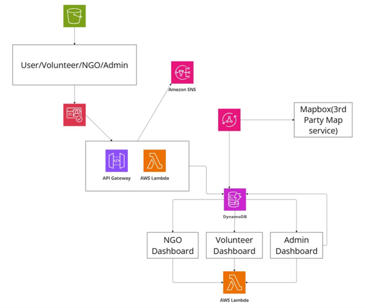
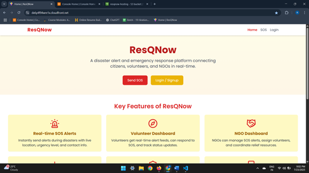
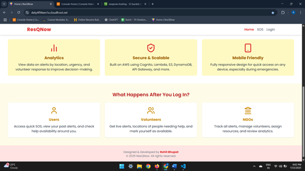
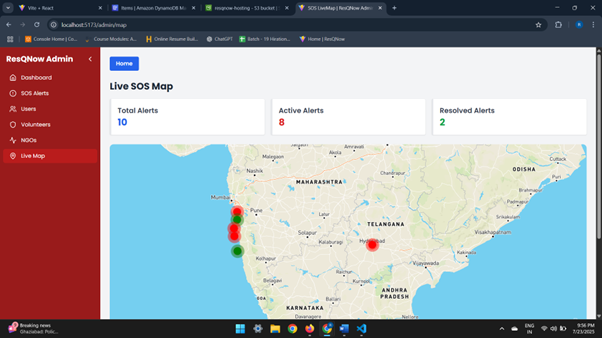
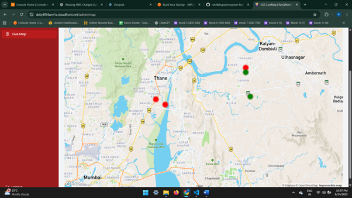

# 🚨 ResQNow – Real-Time Disaster Alert & Emergency Response Platform

ResQNow is a **serverless, real-time disaster alert and emergency response platform** built using **AWS** and **React**.  
It connects **citizens**, **volunteers**, and **NGOs** to coordinate **SOS alerts** using **live GPS tracking**, **dashboards**, and **maps** — built with compassion for people in **disaster-affected** or **conflict zones**.

---

## 📌 Table of Contents
1. [Project Overview](#-project-overview)
2. [Features](#-features)
3. [Architecture](#-architecture)
4. [Tech Stack](#-tech-stack)
5. [How It Works](#-how-it-works)
6. [Screenshots](#-screenshots)
7. [Live Demo](#-live-demo)
8. [Setup Instructions](#-setup-instructions)
9. [Future Enhancements](#-future-enhancements)
10. [Contact](#-contact)

---

## 🌍 Project Overview
During disasters, communication delays can cost lives. **ResQNow** enables:
- Real-time **SOS alert broadcasting**
- **Volunteer coordination** via live maps
- **NGO dashboards** for managing relief efforts
- Secure, scalable, and serverless backend

This project was built as a Proof of Concept to demonstrate AWS's ability to handle mission-critical real-time applications with automated CI/CD pipelines.
---

## ✨ Features
✅ Real-time SOS alert creation & tracking  
✅ Live map with volunteer & victim location markers  
✅ Role-based dashboards for Citizens, Volunteers, and NGOs  
✅ Secure login/signup via **AWS Cognito**  
✅ Alerts & data stored in **AWS DynamoDB**  
✅ File storage (images/reports) in **AWS S3**  
✅ Fully serverless architecture for cost efficiency
✅ CI/CD automation with AWS CodePipeline & CodeBuild
✅ Infrastructure as Code (IaC) with AWS CloudFormation

---

## 🏗 Architecture

  

**AWS Services Used:**
- Amazon Cognito – Authentication & Authorization
- AWS Lambda – Backend APIs
- Amazon API Gateway – API management
- Amazon DynamoDB – NoSQL data storage
- Amazon S3 – File storage
- Amazon CloudFront – CDN for frontend hosting
- Amazon SNS – Alert notifications
- AWS CodePipeline – Automates build & deployment
- AWS CodeBuild – Builds frontend & backend from GitHub source
- AWS CloudFormation – Manages entire infrastructure as code for easy deployment & scaling

---

## ⚙ Tech Stack
**Frontend:** React.js, TailwindCSS
**Backend:** Node.js (AWS Lambda)  
**Database:** Amazon DynamoDB  
**Hosting:** Amazon CloudFront + S3
**Storage:** Amazon S3  
**Auth:** AWS Cognito  
**Notifications:** Amazon SNS
**Map Service:** Mapbox (Third-Party)
**CI/CD:** AWS CodePipeline, AWS CodeBuild
**Infrastructure as Code:** AWS CloudFormation
---

## 🔄 How It Works
1. **User sends SOS alert** with location data
2. **Backend Lambda** stores alert in DynamoDB
3. **WebSocket/Live Map** updates all connected clients
4. **Volunteers/NGOs** get notified and respond
5. **Alerts resolved** once help is provided

---

## 📸 Screenshots

| Home Page | Live Map View |
|-----------|---------------|
|   |  | 


---

## 🎥 Live Demo
[▶ Watch Live Demo](https://dx6y4f94wre1x.cloudfront.net/)  
---

## 🚀 Setup Instructions
```bash
# Clone the repository
git clone https://github.com/rohitbhupat/resqnow.git

# Install dependencies
cd resqnow
npm install

# Start development server
npm run dev